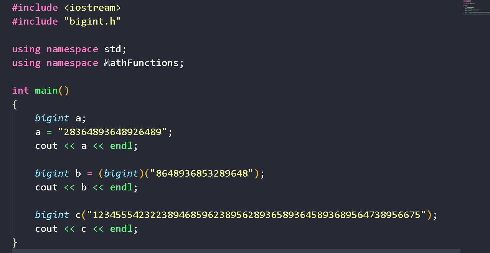
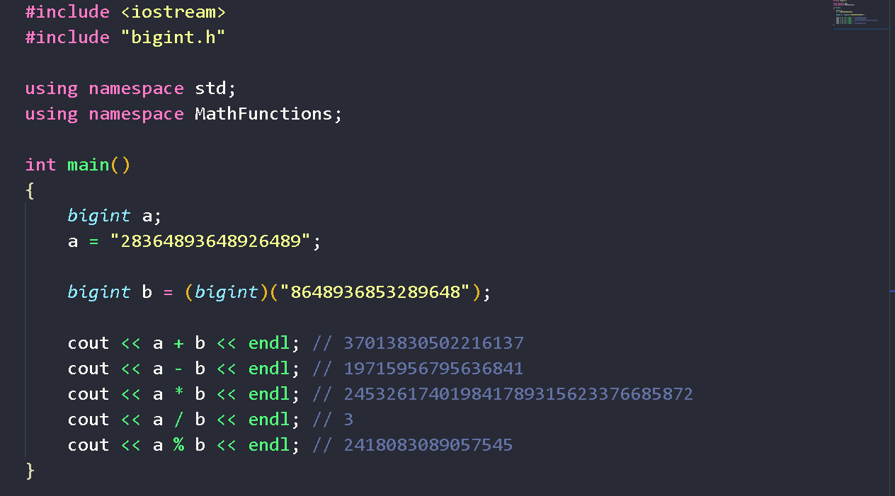
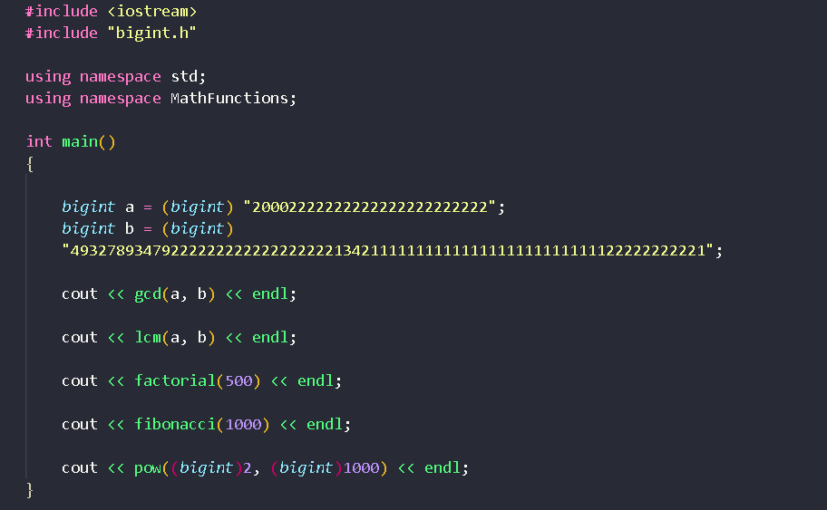

# Big Integer Library (C++)

# Features :
   - ## Arithematic Operations :   
     - ### Addition +  
     - ### Division /
     - ### Modulo %
     - ### Multiplication * 
     - ### Subtraction -

  - ## Math Functions
     - ### Factorial(n)
     - ### Fibonacci(n)
     - ### Gcd(a, b) 
     - ### Lcm(a, b)
     - ### Pow(x, n)

# How to Use :
 - ## Step 1
   - ## To Make Submissions on Online Judges(CodeChef, CodeForces, etc.)
     - ### Copy the code from  [bigint.h](./bigint.h) and paste it in your solution file. 
    
    - ## To Use it locally
       - ### Clone this repository and place [bigint.h](./bigint.h) in same path as of your project.
       - ### Just add these two lines at the start of your file
         - ### #include "bigint.h" 
         - ### using namespace MathFunctions;
  - ## Step 2
    - ### Now we can use all of the above features for Big Integers
    - ## Declarations and Initializations
       
    
    - ## Arithematic Operations
        
    - ## Math Functions
        

